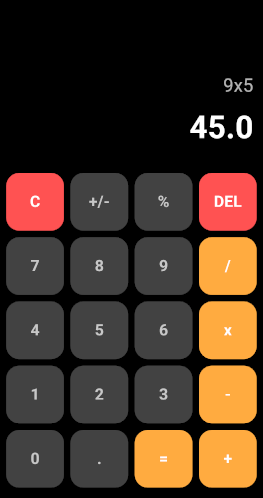

# 🖩 Modern Flutter Calculator App

A sleek and modern calculator app built using **Flutter** with **Material 3 UI** for a smooth user experience.

## ✨ Features
- 🎨 **Modern Dark Theme**
- 🟠 **Material 3 Design** with smooth buttons
- 🔢 **Basic Arithmetic Operations** (+, -, x, /, %)
- 🧮 **Math Expression Parsing** using `math_expressions` package
- 🚀 **Error Handling** for invalid expressions

## 📷 Screenshots


## 🛠️ Installation
1. **Clone the repository**
   ```sh
   git clone https://github.com/your-repo/flutter-calculator.git
   ```
2. **Navigate to the project folder**
   ```sh
   cd flutter-calculator
   ```
3. **Get dependencies**
   ```sh
   flutter pub get
   ```
4. **Run the app**
   ```sh
   flutter run
   ```

## 🏗️ Built With
- **Flutter** (Dart)
- **Material 3 UI**
- **math_expressions** package

## 📜 License
This project is licensed under the MIT License - see the [LICENSE](LICENSE) file for details.
